# Fresh Cooked Tweens

 

A tweening library for Unreal Engine, by [Jared Cook](https://twitter.com/FreshCookedDev)

UE4 and UE5 supported

Purchase the Pro version on Fab here: https://www.fab.com/listings/8d37a3cd-b7d1-4796-9d9e-b160a52192f8
- Easy weak lambdas with `BindTo()`
- TweenQueues
- Spline tweens
- Shortcut functions such as TweenActorLocation and TweenWidgetOpacity

### C++:

```c++
FCTween::Play(
    GetActorLocation(),
    GetActorLocation() + FVector(0, 0, 50),
    [&](FVector t)
    {
        SetActorLocation(t);
    },
    2.0f,
    EFCEase::OutCubic);
```

### Blueprints:


## Table of Contents
> 1. [Plugin Setup](#plugin-setup)
> 1. [Blueprints](#blueprintsection)
> 1. [C++](#cppsection)
> 1. [Easing Functions](#easing-functions)
> 1. [Performance](#performance)
> 1. [Platforms](#platforms)
> 1. [References](#references)
> 1. [License](#license)

## Why Tweens?

Tweening libraries provide convenient curve functions to ease a value be***tween*** a start and end, like a position, scale, color, anything you want to smoothly change. They are useful in small projects and large projects. Many polished UIs have some kind of tween operating.

It can be a large efficiency gain to let a programmer or designer quickly set up a tween with easily tunable values, instead of taking up the art department's precious time tweaking curves manually.

In big projects, they are great for those little polish items. Some small projects can find broader use for them:


```c++
WaddleRotator = GetMesh()->GetRelativeRotation();
WaddleTween = FCTween::Play(
    -WADDLE_ANGLE, WADDLE_ANGLE,
    [&](float t)
    {
        WaddleRotator.Pitch = t;
        GetMesh()->SetRelativeRotation(WaddleRotator);
    },
    WADDLE_SECS, EFCEase::InOutSine)
                  ->SetYoyo(true)
                  ->SetLoops(-1);
```

## Functionality already in Unreal Engine

It's good to know what is already available to you in-engine before installing other tools.
- [Timelines](https://docs.unrealengine.com/4.27/en-US/ProgrammingAndScripting/Blueprints/UserGuide/Timelines/)
  - Useful, but not as easy to tweak as tweens, or to set up in C++
- Ease in/out/inout for sin, expo, circular, smoothstep - `FMath::InterpEaseIn()` lets you define your own exponent, which lets you do quad, cubic, quart, or more.
- [Critically damped springs](https://www.alexisbacot.com/blog/the-art-of-damping)
  - useful for a lot of things, especially cameras. Check out these functions if you haven't heard of that yet:

```c++
FMath::SpringDamper()
FMath::CriticallyDampedSmoothing()
UKismetMathLibrary::FloatSpringInterp()
UKismetMathLibrary::QuaternionSpringInterp()
```

# Plugin Setup
- Copy the FCTween directory into your project's Plugins folder
    - If there is no Plugins folder, create one in the same directory as your .uproject file

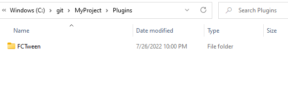

- If you want to use the C++ API, add FCTween to the module names in your main module's Build.cs:
```c#
PublicDependencyModuleNames.AddRange(new[] {"FCTween"});
```

- Open the project
- Click "Yes" when it asks if you would like to rebuild FCTween
- Go to Edit/Plugins, search for FCTween and make sure it's enabled
- Restart the project if needed
- Verify everything is working by going to a blueprint, right clicking and looking for the "Tween" category
- Package the project if you want to double-check it's installed correctly
    - If you package the project and launch the .exe, and it says **Plugin 'FCTween' Failed to load because module 'FCTween' could not be found**, this probably means that you have a blueprint-only project. This is a current bug with UE, and the workaround is to turn it into a C++ project: make a dummy C++ file, and restart the project to recompile it.
        - In UE5: Tools/New C++ Class
        - In UE4: File/New C++ Class
    - It could also mean you just need to force it to recompile by deleting the project and plugin's Intermediate/Build folders and restart.

<a name="blueprintsection"></a>
# Blueprints

## Basic Usage
Add a BP task from the "Tween" category.

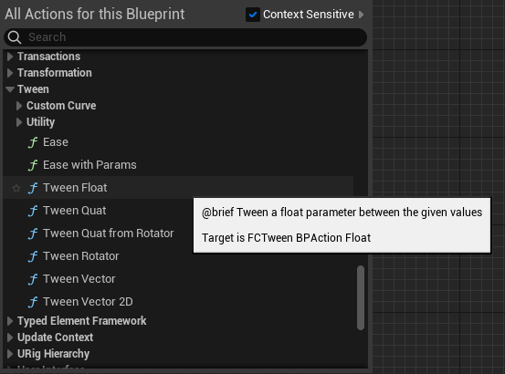

Give it a start and end value, and hook up the Apply Easing pin to your update logic. The Value pin gives you the current value each frame. Here is an example of how to move an actor up 50 units:


Which looks like this:


Here is one that does an infinite bobbing animation:


If you need to do something with the created tween later on, such as stopping it after an interaction, you can use the Async Task pin to operate on the tween.


## Custom Curve

Use one of the versions under "Tweens/Custom Curve" to provide a UE curve as the easing function. These work best with a curve that goes from t=0 to t=1, and then adjust the duration in the tween, for design flexibility.


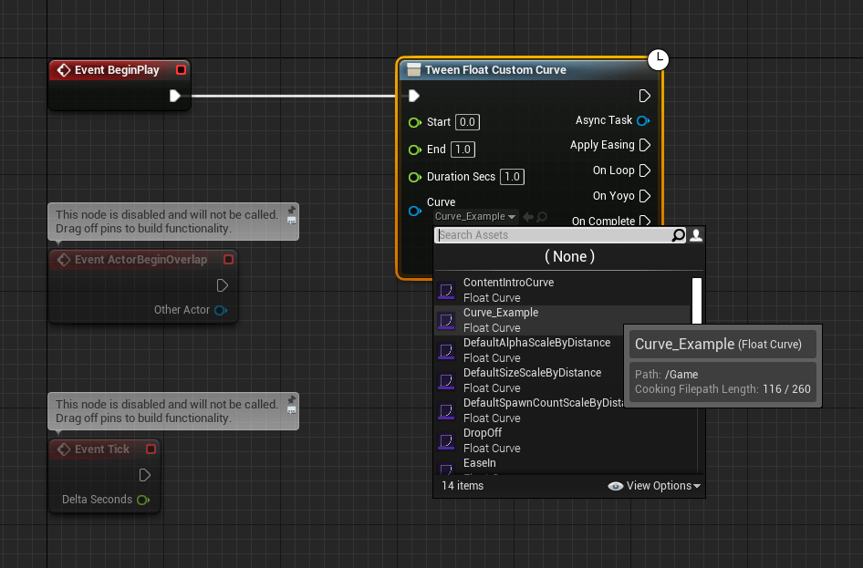

## Ease

Ease a 0-1 float with the given easing function. This is similar to UE's default Ease node, but it has all the FCTween functions available.

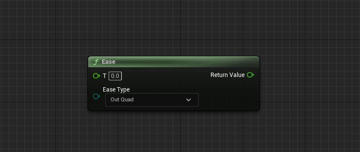

## Ease with Params

Same as ease, but you can override the baked in parameters for Elastic, Bounce, Back, and Smoothstep. 0 means no override provided. Default values are listed in the comments, if you hover over the param.


<a name="cppsection"></a>
# C++

## Module Setup

If you would like to set up FCTween as a code module, instead of a plugin (for easily making code changes to FCTween), expand the section below:

<details>
<summary>Expand</summary>

- After downloading the code, go into FCTween/Source/, and copy the folder inside there into your Source folder.

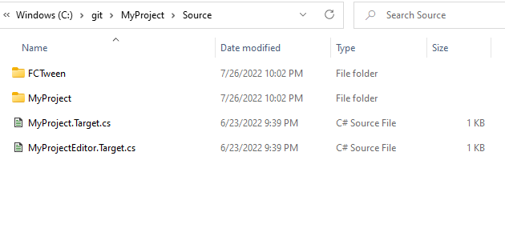

- Make sure you just grabbed the deepest FCTween folder, because you don't need the plugin files when dealing with a module. The FCTween folder you copied should look like this:

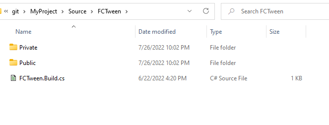

- Add FCTween to the module names in your main module's Build.cs:
```c#
PublicDependencyModuleNames.AddRange(new[] {"FCTween"});
```

- Add FCTween to your Modules list in your .uproject file
```json
"Modules": [
    {
        "Name": "MyProject",
        "Type": "Runtime",
        "LoadingPhase": "Default"
    },
    {
        "Name": "FCTween",
        "Type": "Runtime",
        "LoadingPhase": "Default"
    }
],
```

- Close your IDE, right click on your project's .uproject file, and click "Generate Visual Studio project files" to add it to the solution

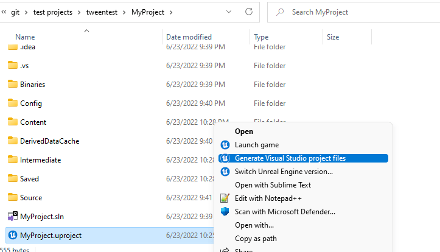

</details>

## Basic Usage

- You can tween Floats, Vectors, Vector2Ds, and Quaternions
- Pass a lambda expression to FCTween::Play() for the update functionality.

Basic example:
```c++
FCTween::Play(0, 1, [&](float t) { Foo = t; }, .5f);
```

With options:
```c++
FCTween::Play(0, 1, [&](float t) { Foo = t; }, .5f, EFCEase::OutElastic)
    ->SetLoops(2)
    ->SetYoyo(true)
    ->SetOnLoop([&]() { /* on loop functionality */ });
```

## Using a custom curve

FCTween won't take in a UCurve (outside of Blueprints, which has helpers that do this same thing), but it's just two extra lines to do the lerp yourself:
```c++
UPROPERTY(EditAnywhere)
UCurveFloat* CustomCurve;

FVector Start = FVector::ZeroVector;
FVector End = FVector(0, 0, 150);

FCTween::Play(
    0, 1,
    [&](float t)
    {
        float EasedFloat = CustomCurve->GetFloatValue(t);
        FVector EasedVector = FMath::Lerp(Start, End, EasedFloat);
        SetActorLocation(OriginalPos + EasedVector);
    },
    10.0f, EFCEase::Linear);
```

## Setting start/end values during execution
Use the specific derived class to set `StartValue` or `EndValue` during execution.

```c++
FCTweenInstanceVector* Tween = nullptr;

virtual void BeginPlay() override
{
    Tween = FCTween::Play(
        Target1->GetActorLocation(), Target2->GetActorLocation(), [&](FVector t) { SetActorLocation(t); }, 10.0f);
    // the set functions return the base tween class, be aware you'll have to static_cast it 
    // if you include it in the same line
    Tween->SetLoops(-1);
}
virtual void Tick(float DeltaSeconds) override
{
    Tween->StartValue = Target1->GetActorLocation();
    Tween->EndValue = Target2->GetActorLocation();
}
```

## Safety / avoiding errors

If your tween's update is calling code on an actor, and that actor gets destroyed, but the tween system is still running the tween, your update lambda will throw an error.

To avoid this, you could:

- **Manually keep track of the pointer and destroy it when you need to**
  - You will need to do this with some tweens anyway, if your game's logic needs to interrupt it, or if it's infinitely looping. Examples for that in the next section.

  
- **Call `FCTween::ClearActiveTweens()`**
  - This is useful for changing levels, if you know you want all tweens to stop executing.


- **Make the lamda itself safe**
  - This is useful for a non-looping tween that you just want to fire and forget, and there are some edge cases where the object is destroyed before it's finished - and you'd rather it just did its last few updates and cleaned itself up.
```c++
FCTween::Play(
    GetActorLocation(), GetActorLocation() + FVector(0, 0, 50),
    [&](FVector t)
    {
        if (IsValid(this))
        {
            SetActorLocation(t);
        }
    },
    2.0f);
```

- **Use UFCTweenUObject**
  - This is a simple UObject wrapper class. You can save this as a UPROPERTY and it will clean up the tween in BeginDestroy().
  - This is nice for something like an item pickup that has a looping tween animation you set up in code, and you want it to get auto-cleaned up when the pickup is destroyed instead of manually managing it.
```c++
UPROPERTY()
UFCTweenUObject* TweenObj;
	
TweenObj = FCTween::Play()
    ->CreateUObject();
```

- **Make a "safe mode" by modifying the library to add try/catch statements around lambda execution in FCTweenInstance, and enable exceptions in the build options**
  - I didn't add this option because it's a controversial move in the C++ world; and the moment I started thinking about how to add it, I sensed a great disturbance, as if millions of voices suddenly cried out in disgust. And, honestly, the other options seem like a better way to handle it.

## Tween Pointers

```c++
#pragma once

#include "FCTween.h"
#include "FCTweenInstance.h"

#include "TweenExample.generated.h"

UCLASS()
class ATweenExample : public AActor
{
	GENERATED_BODY()
	
public:
	UPROPERTY()
	int Foo = 0;

	// raw pointer
	FCTweenInstance* Tween = nullptr;
    
	// UObject wrapper version
	UPROPERTY()
	UFCTweenUObject* TweenUObj;

	virtual void BeginPlay() override
	{
		Super::BeginPlay();

		// tween a float from 0 to 1, over .5 seconds, infinitely looping
		Tween = FCTween::Play(0, 1, [&](float t) { Foo = t; }, .5f)
			->SetLoops(-1);
		
		// UObject version
		TweenUObj = FCTween::Play()
		->CreateUObject();
	}

	virtual void BeginDestroy() override
	{
		if (Tween != nullptr)
		{
			// tells FCTween to recycle this tween
			Tween->Destroy();
			Tween = nullptr;
		}
		
		// UObject version
		if (IsValid(TweenUObj))
		{
			TweenUObj->Destroy();
		}

		Super::BeginDestroy();
	}
};
```
- If you keep a reference to an FCTweenInstance, do not mark it as UPROPERTY(), since it's not a UObject
  - When using the recompile button (live coding), be aware that making changes to a header with a non-uproperty field can bork your memory and cause an editor crash sometimes (usually in BeginDestroy), even if you're managing it properly in code. Close the editor and restart from your IDE when you want to be safe. Or make sure to save and commit your current changes to source control first.
  - If you want to avoid that, **use UFCTweenUObject** instead, since that IS a UObject, and its header won't be changing. Be aware that the UObject is not recycled, so there's a performance cost for that usage.
- Tweens will get recycled when they are finished. If you keep a pointer to it after it's been completed, the tween will just be idle or playing a different set of options/callbacks from who knows where, so you will end up with confusing bugs if you try to operate on it. If you don't want them to get recycled:
  - set NumLoops to -1 (infinite) if you want it to infinitely replay, and you can pause/unpause it
  - OR if you need to be able to restart a tween later on, after it is finished, call `Tween->SetAutoDestroy(false)` to make sure it doesn't get auto-recycled. This is how UFCTweenUObject and the BP tasks make sure their tweens are always valid.
  - If you used one of the above cases, make sure to call Destroy on the tween when you are done with it, so that it gets recycled. Otherwise that memory will never get reclaimed.


## Manual Memory Management

If you have a case that the recycling system doesn't work for, or need to do something custom, you can manage the memory and the update manually.
  - The `new` operator is overridden in UE ([ModuleBoilerplate.h](https://github.com/EpicGames/UnrealEngine/blob/release/Engine/Source/Runtime/Core/Public/Modules/Boilerplate/ModuleBoilerplate.h)) to use FMemory calls (which uses the mimalloc library on Windows), so it's safe to use new/delete in this way in the UE ecosystem.
```c++
#pragma once

#include "FCTween.h"
#include "FCTweenInstance.h"

#include "TweenExample.generated.h"

UCLASS()
class ATweenExample : public AActor
{
	GENERATED_BODY()

public:
	UPROPERTY()
	int Foo = 0;

	FCTweenInstanceVector* ManualTween = nullptr;

	virtual void BeginPlay() override
	{
		Super::BeginPlay();

		ManualTween = new FCTweenInstanceVector();
		ManualTween->Initialize( 
			FVector::ZeroVector, FVector::OneVector, [&](FVector t) { SetActorLocation(t); }, .5f, EFCEase::OutQuad);
		ManualTween->SetYoyo(true)
		    ->SetLoops(-1);
	}

	virtual void BeginDestroy() override
	{
		if (ManualTween != nullptr)
		{
			delete ManualTween;
			ManualTween = nullptr;
		}

		Super::BeginDestroy();
	}

	virtual void Tick(float DeltaSeconds) override
	{
		Super::Tick(DeltaSeconds);
		
		ManualTween->Update(DeltaSeconds, false);
	}
};
```

# Easing Functions
Useful quick reference: https://easings.net/

| Available  | Functions  |              |     |
|------------|------------|--------------|-----|
| Linear     | InCubic    | InExpo       | InBounce    |
| Smoothstep | OutCubic   | OutExpo      | OutBounce   |
| Stepped    | InOutCubic | InOutExpo    | InOutBounce |
| InSine     | InQuart    | InCirc       | InBack      |
| OutSine    | OutQuart   | OutCirc      | OutBack     |
| InOutSine  | InOutQuart | InOutCirc    | InOutBack   |
| InQuad     | InQuint    | InElastic    |             |
| OutQuad    | OutQuint   | OutElastic   |             |
| InOutQuad  | InOutQuint | InOutElastic |             |

## In/Out explanation
Most functions have an In, Out, and InOut version. This indicates which end of the function the easing takes place.

"In" means the easing happens at the start:


"Out" means the easing happens at the end:


"InOut" means the easing happens at start and end:

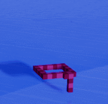

## Examples

Linear
- It's just a lerp


Sine
- Quad is usually preferred, since this one uses a Sine operation and is more expensive. But it's more gradual than Quad is, so it can be useful in places where you need the smoothest ease possible.

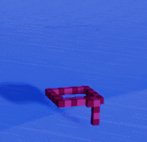

Quadratic
- The bread and butter - cheap formula (t * t) and looks good


Cubic
- A more drastic Quadratic (t * t * t)


Quartic
- Even more drastic (t * t * t * t)


Quintic
- Veeeery drastic (t * t * t * t * t)

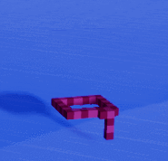

Exponential
- Like Quintic but even sharper

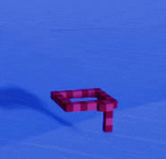

Circular
- The graph is a quarter circle. Makes it feel like the velocity changed suddenly. The start is faster than Quint but the end is slower than Quad. Use InCirc to be slow and then fast, instead


Smoothstep
- Pretty similar to InOutQuad


Stepped
- It's kind of like the opposite of easing, but here it is anyway
- Change EaseParam1 to set how many steps to use. It's set to 10 by default


Elastic
- Cartoony "boing" effect. May take parameter tweaking to get it just how you want it in your game. Use EaseParam1 and EaseParam2 to tweak the amplitude and period. Looks good with scale, or menus transitioning on screen.
- EaseParam1 (Amplitude) is set to 1.0 by default. Raise it to make it wobble farther, lower it to make it smaller.
- EaseParam2 (Period) is set to 0.2 by default. Smaller is spazzier (more wave cycles in the same amount of time). Bigger means less cycles.


Bounce
- Bounces back from the target a couple of times


InBack
- Anticipation; pull back a little before going forward
- EaseParam1 (Overshoot) is set to 1.70158 by default. If you want to know why, here you go: https://github.com/Michaelangel007/easing#the-magic-of-170158


OutBack
- It overshoots the target and then pulls back to meet it. You can tweak the overshoot amount with EaseParam1.

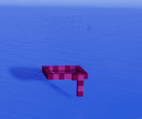


# Performance

- FCTween uses a LinkedList to keep track of tweens, for fast adding/removal
- Recycles old tweens to avoid unnecessary memory allocations
- Lets you EnsureCapacity() to preallocate your memory during game load
    - also comes with console warnings when you stop PIE to let you know when you could increase your initial capacity for performance
- Small memory footprint, using basic C++ classes outside of the UObject ecosystem

## Stress Tests

Here is the stress testing project, if you want to run it yourself: https://github.com/jdcook/ue_tween_library_stress_test

**Memory is the difference shown in the Low Level Memory Tracker once the tweens initialize. I don't believe any of the libraries take up that many Megabytes, that is just what is displayed in the LLM. So it's just to get an idea of how the libraries compare.**

### 20,000 tweens on startup, +1 per frame

|          | Initialize Milliseconds | Frames Per Second | Freeze after startup tweens complete | Memory |
|----------|-------------------------|-------------------|--------------------------------------|--------|
| FCTween  | 1.39 ms                 | 60 fps            | 0                                    | ~9MB   |
| BUITween | 10.06 ms                | 55 to 60 fps      | 0                                    | ~10 MB |
| iTween   | 282 ms                  | 11 to 46 fps      | 2 seconds                            | ~41MB  |


### 40,000 tweens on startup, +40 per frame

|          | Initialize Milliseconds | Frames Per Second | Freeze after startup tweens complete | Memory |
|----------|-------------------------|-------------------|--------------------------------------|--------|
| FCTween  | 2.4 ms                  | 60 fps            | 0                                    | ~21MB  |
| BUITween | 25.58 ms                | 40 to 60 fps      | 7 seconds                            | ~34 MB |
| iTween   | 578 ms                  | 6 to 24 fps       | 8 seconds                            | ~88MB  | 


### 80,000 tweens on startup, +80 per frame

|          | Initialize Milliseconds | Frames Per Second | Freeze after startup tweens complete | Memory |
|----------|-------------------------|-------------------|--------------------------------------|--------|
| FCTween  | 4.23 ms                 | 60 fps            | 0                                    | ~44MB  |
| BUITween | 50.05 ms                | 27 to 60 fps      | 22 seconds                           | ~50MB  |
| iTween   | 1207 ms                 | 3 to 12 fps       | 23 seconds                           | ~175MB |


Notes on performance

- Test details: create X tweens on initialize, and Y tweens per frame. The FPS varies over the course of the test because of the tweens per frame, so take the lowest and highest FPS.
- This test assumes that you used EnsureCapacity() on game startup to pre-allocate all memory for FCTween, eliminating the time to allocate memory for new tweens
- BUITween is very close on memory, but FCTween is a little bit slimmer because BUI keeps track of all possible UI properties in each instance
- BUITween's update is really about the same speed as FCTween, the only thing bringing it down is the cost of creating/destroying tweens; it uses an array to keep track of them and doesn't recycle, incurring a bit more cost
- I appreciate the engineers on the other tweening projects, I learn lots of things from open source code and appreciate how they both put their code out in the wild.

# Platforms

I've only tested packaging for Windows, so if you are shipping on Linux, Mac, Android, iOS, or a console, be sure to test packaging early.

# References
- http://robertpenner.com/easing/
  - The original easing functions.
- https://github.com/Michaelangel007/easing
  - Handier versions of those functions.
- https://github.com/photonstorm/phaser/tree/master/src/math/easing
  - The specific version of the Stepped and Elastic functions comes from Phaser.
- https://easings.net/
  - Useful visual reference

# License

MIT

The easing functions themselves are derivative of other people's work, and their licenses have been included in `FCEasing.h`
